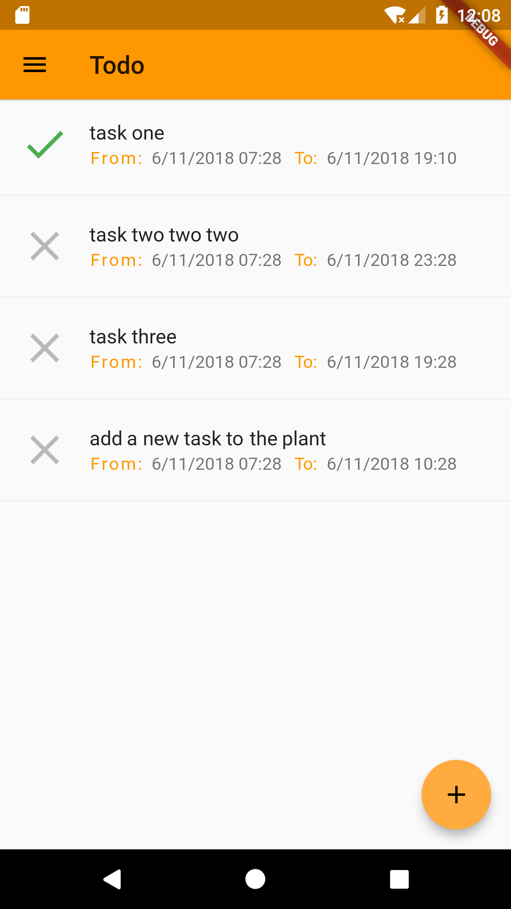

### Flutter Todo Project

A complete and open source Todo designed in flutter. This app exploits Sqlite databse that enables faster loading of songs at startup. Only one time setup for loading songs is needed. This app comes with a lot of features and a more are coming soon. 

#### Todos

- [ ] task list paginate
- [ ] task archive by month
- [ ] upload the image to set a avatar
- [ ] Optimize the code, reuse the code

